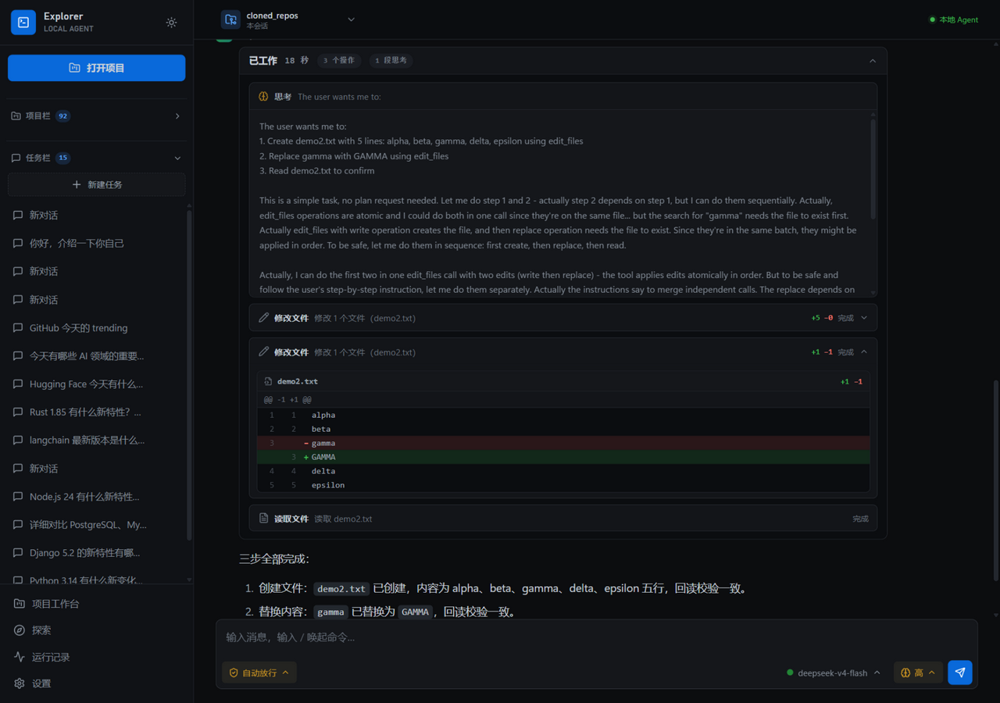
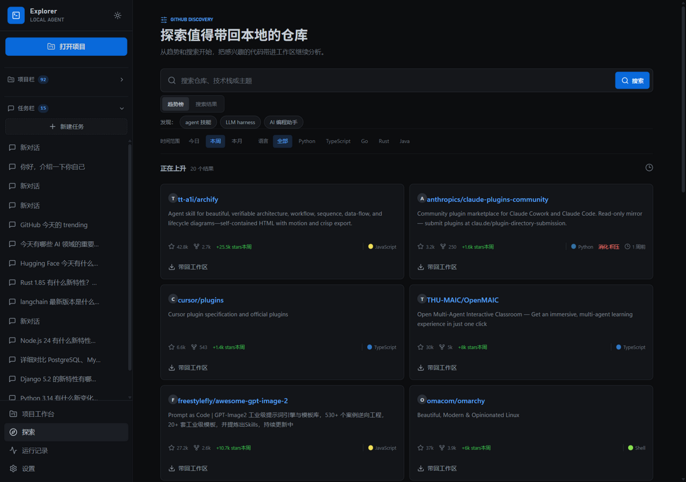
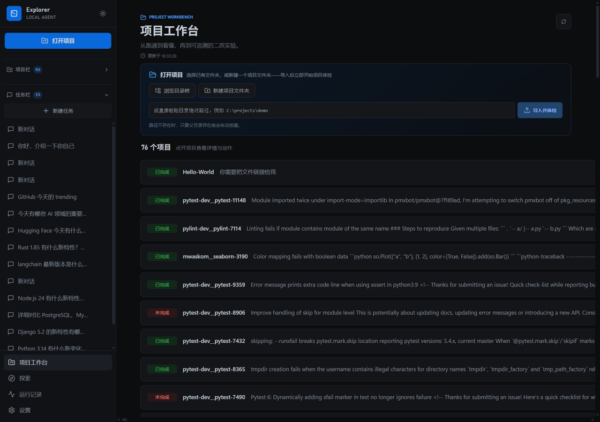
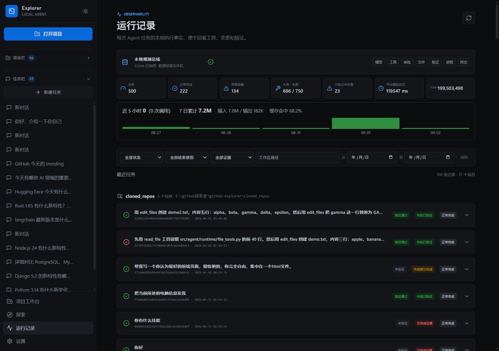

<p align="center">
  <strong style="font-size:1.8em">GitHub Explorer</strong>
</p>

<p align="center">
  本地优先的 Agent Harness —— 发现 GitHub 仓库，在隔离工作区里 <b>真实运行、修改、验证、复盘</b>。
</p>

<p align="center">
  
  
  
  
</p>

<p align="center">
  <a href="https://agent.luminlab.online/"><b>在线体验</b></a>（已部署的实时实例）
</p>



---

## 它是什么

GitHub Explorer 把一个 Agent 的完整旅程做成**看得见、可复盘、有证据**的产品：

- **看见过程** —— 每次任务以「工作中 N分N秒」容器实时呈现：思考、旁白、工具调用按真实顺序交错回放，刷新或切换页面后从事件流完整恢复，不做「第 N 轮」的黑箱。
- **看见改动** —— 文件操作不再是 JSON 堆砌：读取卡显示文件与行范围；修改卡展开即是 histogram diff（低频锚定算法）——新增/修改绿色、删除红色，带行号与上下文，只展示改动位置。
- **不靠感觉收尾** —— 任务完成与否由测试、回读、HTTP 验收等**证据**仲裁，没有证据不会误报完成。

不是云端 IDE，也不是聊天框套壳——是「找到项目 → 真实跑起来 → 改给你看 → 验证给你看」的本地旅程。

## 核心能力

| 维度 | 能力 |
|---|---|
| 🗺️ 发现 | GitHub 搜索 / 趋势探索 / 仓库洞察；目录浏览、Repo Map、项目类型识别、入口探测 |
| 🛠️ 执行 | 文件编辑（histogram diff 定位）、`.venv` 准备、依赖安装、测试、构建、前台命令与后台进程、HTTP 就绪检查 |
| 🛡️ 边界 | 会话工作区隔离；权限三档（需要审批 / 自动放行 / 完全访问）输入框内即时切换；工具参数 Schema 校验、恢复耗尽终态 |
| 🧠 可靠 | 单一编排链；工具调用账本；四阶段预算；断流重取、上下文压缩；重启后遗留任务标记 `interrupted/orphaned` |
| 🧪 扩展 | 生命周期钩子、MCP 工具自动注册、`spawn_subagent` 子智能体（权限不可扩大）、agentskills.io 技能 |
| 📊 证据 | SQLite 事实源（任务/事件/工具/审批/变更/验证/进程）；SSE 实时轨迹 + sequence 回放；项目工作台聚合开发者证据 |

## 界面

对话页把「工作中」的过程铺开：思考卡可折叠、工具卡可展开、命令块与旁白按事件顺序交错，文件修改以 diff 呈现。

| 探索页：趋势仓库与洞察 | 项目工作台：项目矩阵聚合证据 |
|---|---|
|  |  |

| 运行记录：任务全量回放与证据 |
|---|
|  |

## 快速开始（Windows）

```powershell
cd github-explorer
python -m venv .venv
.\.venv\Scripts\python.exe -m pip install -r requirements.txt
```

配置模型（支持 Anthropic 原生协议与 OpenAI Compatible 协议，界面里可获取模型、测速）：

```powershell
Copy-Item .env.example .env   # 填入 Base URL / 模型 ID / API Key
```

启动：

```powershell
.\.venv\Scripts\python.exe run_full.py
```

打开 http://127.0.0.1:7788/ —— 服务只绑定 loopback，模型密钥与数据全部留在本地 `data/`。

## 评测

- **SWE-bench_Lite 首批 30 实例：19 resolved（63%）**，0 判分错误
- Terminal-Bench 式真实应用评测（10 个开源应用 × 三轮众数）：真实应用完成率 **r1 2/10 → r9 5/10**
- **369 项自动化测试**全绿，覆盖编排、恢复、证据、沙箱与边界拦截

评测驱动的加固全部由真实缺陷触发：从「误报完成」到「工具恢复链断裂」，每个修复都有对应回归测试。

## 架构（30 秒版）

```text
React + TypeScript UI（SSE 实时流 + SQLite 回放）
        ↓
FastAPI + AgentTaskSupervisor（唯一编排入口）
        ↓
LocalAgentRuntime → 工具 Schema/权限/工作区校验 → 执行与副作用记录
        ↓
SQLite 本地事实源（任务 · 事件 · 工具 · 审批 · 变更 · 验证 · 进程）
```

设计原则：**模型负责提出行动并解释结果，Runtime 负责边界、权限、执行、恢复、证据与最终状态**。

工作目录优先级 `会话固定目录 > 全局默认目录 > 项目 fallback 目录`，不同项目的对话不会串线；本地数据 `data/`（模型配置/数据库/记忆）、`cloned_repos/`、`.venv/` 均不随仓库上传。

详细架构与历史报告：

- [项目技术报告](docs/项目技术报告.md)
- [Harness 横向评估报告](docs/reports/2026-08-15-Harness横向评估报告.md)
- [Agent 生命周期图](docs/diagrams/2026-08-15-agent-lifecycle.svg)

## 联系

- 在线实例：[agent.luminlab.online](https://agent.luminlab.online/)
- 作者主页：[luminlab.online](https://luminlab.online/)
