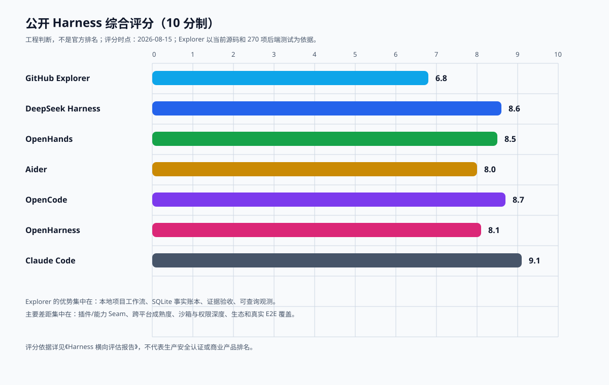

# GitHub Explorer Harness 横向评估报告

> 评估日期：2026-08-15（Asia/Shanghai）
> 评估对象：GitHub Explorer 当前源码，以及 DeepSeek Harness、OpenHands、Aider、OpenCode、OpenHarness、Claude Code 公开仓库与文档
> 评估结论：GitHub Explorer 当前综合 **6.8 / 10**，已从“能调用工具的 Demo”进入“有事实账本和可恢复任务的本地 Harness 原型”，但距离成熟 Harness 的生产级能力仍有明显差距。



## 1. 评估边界与方法

本报告不把 GitHub Star 数当成质量分，也不推断闭源或未公开实现。评分来自四类证据：

1. GitHub 当前仓库元数据、README、架构文档和公开测试说明。
2. GitHub Explorer 当前源码、数据库结构、前后端测试和 7788 实机状态。
3. 已记录的多轮全栈测评、P1-P5 推进日志和失败案例。
4. 对 Agent Harness 生产能力的统一维度打分。

Claude Code 仓库虽然公开，但许可证和内部实现边界需要单独核实，因此它在本报告中作为公开产品参考，不作为“完全可复用的开源实现”处理。

## 2. 当前基线

### 2.1 GitHub Explorer 已具备的能力

| 能力 | 当前状态 | 证据 |
|---|---|---|
| 单一主编排链 | 已完成 | `AgentTaskSupervisor` + `LocalAgentRuntime` |
| 本地工作区绑定 | 已完成 | session sticky、默认工作目录、current path |
| 工具调用账本 | 已完成 | `agent_tool_calls`、唯一 call_id、恢复关系 |
| 任务事件回放 | 已完成 | `agent_events.sequence`、SSE after_sequence |
| 需求账本 | 已完成 | `session_requirements`、pending/完成证据 |
| 轻量指标快照 | 已完成 | `agent_task_metrics`、指标版本 |
| 结构化验收 | 已完成 | 文件、测试、进程、HTTP 和 acceptance evidence |
| 诊断预算 | 已完成 | 阶段预算、重复观察去重、重规划 |
| 本地观测 | 已完成 | Activity、traces、evaluation-report |
| 模型配置 | 已完成 | Anthropic/OpenAI-compatible、自定义 URL、密钥不回显 |
| 失败恢复 | 已完成基础 | recovery key、resume、interrupted/orphaned 状态 |
| 真正沙箱 | 未完成 | 当前是工作区边界和权限策略，不是 OS 级隔离 |
| 插件/能力 Seam | 未完成 | 工具注册表可扩展，但没有完整服务提供者/消费者契约 |
| 多 Agent 协作 | 暂缓 | 当前主链路不依赖多 Agent |
| 浏览器级 E2E | 暂缓 | 当前以 SSE 传输契约和 API 回放测试为主 |

### 2.2 质量基线

```text
后端：270 passed, 1 warning
前端：35 passed
Vite：1622 modules transformed
7788：127.0.0.1:7788，健康检查 200
结构化报告：100 tasks / 1181 tools / 89 changed files / 65 artifacts
```

这说明 Explorer 的“事实记录、测试和观测”已经是实质能力，而不是单纯的 UI 展示；但测试数量和生态覆盖仍明显小于成熟项目。

## 3. 统一评分维度

评分采用 8 个维度，每项 0-10 分，综合分为等权平均后再结合当前实际使用目标进行小幅修正：

| 维度 | 关注点 |
|---|---|
| 执行可靠性 | 循环、终态、失败恢复、取消、断线重连、重启恢复 |
| 工具协议与权限 | Schema、调用生命周期、审批、风险阻断、命令安全 |
| 工作区与项目工作流 | cwd、项目发现、依赖、服务启动、端口和进程所有权 |
| 记忆与上下文 | 会话、压缩、需求账本、跨轮恢复、上下文成本 |
| 观测与证据 | 事件源、trace、验收事实、指标、回放和报告 |
| 扩展性 | 插件、能力接口、Provider、MCP、Skill、替换成本 |
| 用户体验 | CLI/TUI/Web、交互反馈、模型配置、长任务体验 |
| 测试与生态成熟度 | 单元、集成、E2E、跨平台、文档、社区和发布质量 |

## 4. 综合评分表

| Harness | 执行可靠性 | 工具/权限 | 项目工作流 | 记忆/上下文 | 观测/证据 | 扩展性 | UX | 测试/生态 | 综合分 |
|---|---:|---:|---:|---:|---:|---:|---:|---:|---:|
| GitHub Explorer | 7.2 | 7.2 | 7.5 | 7.6 | 8.0 | 5.8 | 6.8 | 5.9 | **6.8** |
| DeepSeek Harness | 8.8 | 8.8 | 8.0 | 9.1 | 8.4 | 9.2 | 8.5 | 8.5 | **8.6** |
| OpenHands | 8.6 | 8.4 | 8.8 | 8.5 | 8.0 | 8.5 | 8.8 | 8.5 | **8.5** |
| Aider | 8.1 | 8.0 | 8.8 | 7.1 | 6.8 | 6.4 | 7.0 | 7.6 | **8.0** |
| OpenCode | 8.8 | 8.8 | 8.6 | 8.8 | 8.2 | 9.1 | 8.7 | 8.5 | **8.7** |
| OpenHarness | 8.4 | 8.5 | 8.2 | 8.4 | 7.6 | 8.7 | 8.3 | 7.5 | **8.1** |
| Claude Code* | 9.2 | 9.1 | 9.0 | 9.2 | 8.4 | 8.5 | 9.0 | 9.0 | **9.1** |

`* Claude Code 为公开仓库/产品参考，内部实现、许可证和服务端能力不完全可复用。`

### 4.1 分差意味着什么

Explorer 与第一梯队的差距不是“少几个工具”，而是四个系统层面的差距：

| 差距 | 当前表现 | 成熟 Harness 的做法 |
|---|---|---|
| 能力替换边界 | 工具注册表可扩展，但 Runtime 仍直接依赖本地实现 | DeepSeek/OpenCode 将模型、工具、会话、终端、沙箱抽成明确 Seam |
| 安全执行层 | 工作区和权限检查已存在，但不是 OS 级沙箱 | OpenHands/Claude/OpenHarness 有更完整的容器、权限模式或命令拦截 |
| 生态与扩展 | MCP、Skill 有入口，插件生命周期尚不完整 | OpenHarness/DeepSeek 以插件、Profile、Bundle 组合能力 |
| 端到端成熟度 | 后端事实链强，真实浏览器和跨平台覆盖较薄 | OpenHands/OpenCode/Claude 有更宽的客户端、运行时和 E2E 覆盖 |

## 5. 各 Harness 详细对比

### 5.1 DeepSeek Harness：8.6 / 10

官方仓库：[deepseek-ai/deepseek-harness](https://github.com/deepseek-ai/deepseek-harness)
架构文档：[DeepSeek Harness Architecture](https://github.com/deepseek-ai/deepseek-harness/blob/master/docs/architecture.md)

**核心长处**

- Cordis 插件树把模型适配器、工具、会话日志、Agent Loop、持久化、沙箱和审批策略都视为可替换服务。
- `SessionEvent` 是持久事实源，实时 `agent/*` 事件只承担执行期扩展；模型可见内容必须能从日志重建。
- 明确区分 Turn、Step、Tool Pipeline，并把 `pre-execute → execute → post-execute` 作为工具生命周期。
- 能力 Seam 有服务定义、服务提供者和消费者三部分，替换 Provider 时不需要复制整个 Agent Loop。
- 文档把运行时不变量和已知限制写进架构，而不是只展示成功路径。

**短处与代价**

- Cordis 和插件树复杂度很高，学习成本明显高于 Explorer 的 Python 模块化方案。
- 对个人本地项目来说，完整配置层、Profile、Bundle 和插件卸载语义可能过度设计。
- 生态和产品形态仍在快速变化，部分能力需要跟随其运行时约定。

**Explorer 应借鉴什么**

优先借鉴“模型可见即有日志事实”“能力 Seam”“Turn/Step 生命周期”和“不变量文档”；暂不照搬 Cordis。

### 5.2 OpenHands：8.5 / 10

官方仓库：[OpenHands/OpenHands](https://github.com/OpenHands/OpenHands)
文档入口：[OpenHands docs](https://github.com/All-Hands-AI/OpenHands/tree/main/docs)

**核心长处**

- 面向真实软件开发任务，覆盖浏览器、终端、代码编辑、执行环境、Agent Server 和 Web UI。
- 事件驱动模型、终端状态和客户端连接相对解耦，适合长任务和远程运行。
- 对执行环境、沙箱、容器和 Agent Server 的分层比 Explorer 更完整。
- 真实项目场景、基准测试和 E2E 覆盖更广，作品完成度与 Harness 质量可以分别评估。

**短处与代价**

- 运行体量、部署复杂度和资源消耗明显高于 Explorer。
- 对 Windows 本地优先和轻量学习场景并非默认最优。
- 事件、运行环境和前端状态的组合较复杂，二次定制门槛高。

**Explorer 应借鉴什么**

借鉴事件/连接解耦、执行环境隔离、后台任务和真实 E2E；保留 Explorer 的 SQLite 本地账本和轻量启动体验。

### 5.3 Aider：8.0 / 10

官方仓库：[Aider-AI/aider](https://github.com/Aider-AI/aider)
Repo Map 文档：[aider repo map](https://aider.chat/docs/repomap.html)

**核心长处**

- 产品定位清晰：终端里的 AI Pair Programming。
- Repo Map、模型能力诊断、Git 自动提交、diff 解析、lint/test 反馈形成高效闭环。
- CLI 工作流短、反馈快、跨模型支持广，适合开发者高频使用。
- 对“模型写完代码后要立即运行检查”这一点比很多 Demo 更扎实。

**短处与代价**

- 它更聚焦代码协作，不负责完整的项目发现、依赖部署、后台进程和可观测工作台。
- 长期任务、跨页面恢复、结构化事件账本和多层证据不是其核心产品重点。
- 对小白、学习者和非 CLI 用户的引导较弱。

**Explorer 应借鉴什么**

借鉴 Repo Map、模型能力探测、Git 变更闭环和失败退出码；把它们放进 Explorer 的项目旅程，而不是复制 Aider 的 CLI 交互。

### 5.4 OpenCode：8.7 / 10

官方仓库：[anomalyco/opencode](https://github.com/anomalyco/opencode)

**核心长处**

- 以本地开发 Agent 为中心，具备持久工作上下文、终端、工具、事件和多客户端体验。
- 对上下文压缩、Windows shell、凭据更新、工具输出托管等工程细节投入较深。
- 扩展模型、客户端和工具的边界较清晰，生态与社区活跃度很高。
- UI/CLI/远程工作流组合比 Explorer 更成熟。

**短处与代价**

- TypeScript/多包工程和抽象层数量带来较高维护成本。
- 部分设计为通用开发者 Agent 优化，不会天然解决 GitHub 项目学习和部署路径。
- 复杂度高，Explorer 不应直接照搬其所有 Effect/Layer 或服务抽象。

**Explorer 应借鉴什么**

借鉴可重放压缩、持久上下文、工具输出托管、Windows 命令适配和凭据原子更新。

### 5.5 OpenHarness：8.1 / 10

官方仓库：[HKUDS/OpenHarness](https://github.com/HKUDS/OpenHarness)

**核心长处**

- 把 Agent Loop、工具、Skill、Plugin、权限、Hook、MCP、Memory、Task 和 UI 组合在同一 Harness 里。
- Provider Profile 支持 Anthropic-compatible、OpenAI-compatible、DeepSeek、Ollama、Copilot 等多种后端。
- 具有 Resume、Plan Mode、权限模式、Hook 和插件兼容层，适合个人 Harness 实验。
- 对“模型是 Agent，代码是 Harness”的边界表达清楚。

**短处与代价**

- 功能面非常宽，容易出现个人 Agent、CLI、插件、任务系统同时膨胀的问题。
- 作为社区研究项目，部分能力和生态成熟度仍低于 OpenHands/OpenCode/Claude Code。
- 多 Agent、定时任务、远程触发等能力不应在 Explorer 当前阶段提前引入。

**Explorer 应借鉴什么**

借鉴 Provider Profile、Skill 按需加载、Hook、权限模式和插件目录约定；暂不引入其完整多 Agent 协调器。

### 5.6 Claude Code：9.1 / 10（参考项）

公开仓库：[anthropics/claude-code](https://github.com/anthropics/claude-code)

**核心长处**

- 产品完成度、任务交互、上下文管理、权限提示、终端体验和开发者心智模型都很成熟。
- 对长任务、计划、工具调用、代码修改、测试和 Git 工作流的整合度高。
- 生态、文档、Skill/Plugin 约定和用户反馈闭环强。

**边界与限制**

- 公开仓库不等于内部实现完全公开；不能把未公开的服务端能力当成可直接复用的架构事实。
- 产品深度绑定 Anthropic 生态和其交互设计，模型/Provider 中立性不如 Explorer 的自定义 URL 方案。
- 对本地学习者和 GitHub 项目探索的产品路径不是其主要定位。

**Explorer 应借鉴什么**

借鉴权限交互、计划与执行的节奏、Skill/Plugin 体验和最终回复质量；不复制其供应商绑定。

## 6. Explorer 的优势与短板

### 6.1 Explorer 已经做得好的地方

1. **本地项目旅程更明确。** 从 GitHub 发现、克隆、理解、安装、运行到二改，产品场景比纯代码 Agent 更完整。
2. **事实链比 UI 更重要。** `agent_events`、`agent_tool_calls`、`session_requirements`、`agent_task_metrics` 和结构化 acceptance 已经形成真正可查询的证据链。
3. **适合 Windows 本地操作。** 当前工作区、`.venv`、PowerShell/cmd、端口和进程所有权都被当成一等事实。
4. **主链路已收敛。** LangGraph/LangSmith 不再承担生产主编排和主观测，避免两套状态机并行漂移。
5. **观测具有本地隐私优势。** Activity、trace 和测评报告默认落在本地 SQLite，不依赖远程 SaaS。

### 6.2 Explorer 当前的硬短板

1. **安全边界还不是企业级沙箱。** 工作区 containment 和风险策略不等于容器、系统调用或网络级隔离。
2. **扩展性弱于插件型 Harness。** Tool Registry 已有，但缺少完整的 Provider/Consumer/生命周期 Seam。
3. **跨平台和生态覆盖有限。** 当前大量验证集中在 Windows + Python + Node；其他语言和包管理器的证据规则仍要扩展。
4. **真实 UI E2E 较少。** SSE 回放契约已经有，但真实浏览器页面切换、网络中断和长任务 UI 仍未自动化。
5. **自动修复闭环尚未完成。** 当前优先保证本地执行和验收，尚未把 patch、隔离 worktree、用户确认、commit、push、PR 组成默认链路。
6. **模型能力依赖外部 Provider。** DeepSeek 等模型的额度、协议和响应质量仍会影响测评，需要更强的模型健康与降级策略。

## 7. 差距排序与建议路线

### P0：继续夯实事实和边界

- 让所有模型可见输入都能从事件账本重建。
- 为 process、approval、verification、acceptance 固定生命周期不变量。
- 把高风险命令从“展示风险”升级为后端真正阻断和确认。
- 继续扩展测试证据规则，但不允许模型自报覆盖事实。

### P1：补齐能力 Seam，而不是堆更多工具

- 为 ModelProvider、WorkspaceExecutor、ProcessManager、EvidenceStore 定义稳定接口。
- 工具只依赖接口，不直接读取全局环境变量和 SQLite 细节。
- 把 MCP、Skill、自定义模型和本地项目服务接入这些接口。
- 保持默认单 Agent Runtime，暂缓多 Agent 并行。

### P2：把项目旅程做成可验证产品

- 项目概览、架构地图、依赖安装、服务启动和验收报告共享同一任务事实。
- 作品状态与任务终态并列展示，减少“任务 incomplete 但作品可运行”误解。
- 增加可选浏览器测试 skill，但不把浏览器自动化放进核心运行时。

### P3：安全与发布闭环

- 隔离 worktree/临时分支应用 patch。
- 用户确认后才 commit、push 或创建 PR。
- 引入可选容器/沙箱 Provider，保持本地 Windows Provider 兼容。

## 8. 最终判断

GitHub Explorer 不是成熟 Harness 的简单低配版，它已经在“GitHub 项目发现 + 本地执行 + 事实观测”这个交叉场景形成了自己的方向。当前 **6.8 分** 的含义是：核心方向和事实链已经成立，但扩展边界、安全隔离、生态成熟度和 E2E 覆盖仍不足以与 OpenCode、DeepSeek Harness、OpenHands 或 Claude Code 的整体完成度相提并论。

最值得继续投入的不是复制更多工具，而是把现有账本、工作区、验收和观测抽成稳定能力边界。完成 P0/P1 后，Explorer 有机会在“本地 GitHub 项目学习与二次开发工作台”这一细分定位达到 8 分以上，而不是在通用代码 Agent 赛道正面复制大厂产品。

## 9. 资料来源

- [DeepSeek Harness README](https://github.com/deepseek-ai/deepseek-harness)
- [DeepSeek Harness Architecture](https://github.com/deepseek-ai/deepseek-harness/blob/master/docs/architecture.md)
- [OpenHands](https://github.com/OpenHands/OpenHands)
- [Aider](https://github.com/Aider-AI/aider)
- [Aider Repo Map](https://aider.chat/docs/repomap.html)
- [OpenCode](https://github.com/anomalyco/opencode)
- [OpenHarness](https://github.com/HKUDS/OpenHarness)
- [Claude Code](https://github.com/anthropics/claude-code)
- [Explorer 既有研究：DeepSeek Harness 与主流 Agent](../../项目推进记录/2026-08-14-DeepSeek-Harness与主流Agent研究记录.md)

> GitHub 元数据抓取时点：2026-08-15。Star、fork 和更新时间只用于说明项目活跃度，不参与综合评分。
