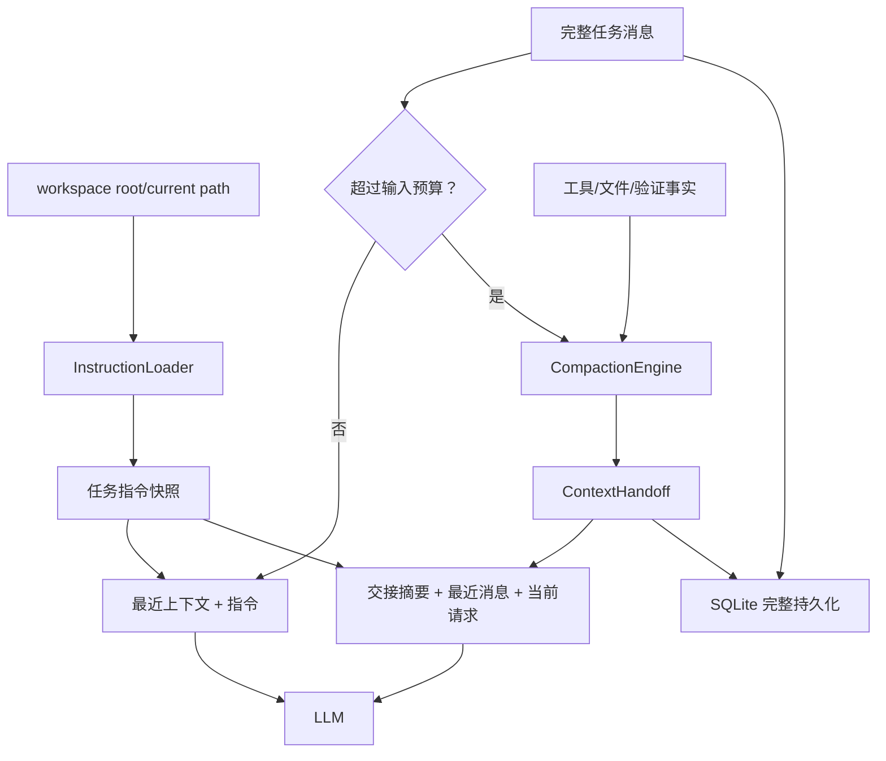

# Agent Memory Foundation Design

## 1. 目标

第一阶段只建立两项基础能力：

1. 支持 Codex 风格的层级 `AGENTS.md` 指令加载，并区分项目规则与本机覆盖规则。
2. 将上下文超限后的“删除最旧消息”升级为结构化交接摘要，使任务可以在有限上下文内继续而不丢失关键事实。

Thread Event Store、项目长期记忆、SQLite FTS5、Git 变更记忆和向量检索不进入本阶段。它们依赖本阶段形成的指令来源和摘要协议，后续分别设计和实施。

## 2. 设计原则

- 指令不是历史：`AGENTS.md` 描述 Agent 应遵守的规则，不写入聊天历史。
- 历史不是记忆：原始消息与工具事件完整持久化，模型上下文只加载当前需要的部分。
- 摘要不是自由文本：交接摘要使用稳定结构，保留目标、决策、约束、文件、验证、失败和下一步。
- 来源可追溯：每条项目指令和摘要都记录来源路径或任务 ID。
- 本机覆盖不提交：`AGENTS.override.md` 用于个人机器规则，默认加入 `.gitignore`。
- 不记录秘密：API Key、Token、Authorization 和密码不能进入指令摘要或长期记忆。
- 失败可降级：摘要生成失败时保留最近消息并使用确定性的本地事实摘要，不能让 Agent 任务失败。

## 3. 层级指令加载

### 3.1 发现规则

以当前会话 `workspace_root` 为项目边界，以 `current_path` 为加载终点：

1. 读取用户级 `%USERPROFILE%\.github-explorer\AGENTS.md`，如果存在。
2. 从 `workspace_root` 到 `current_path` 逐级查找 `AGENTS.md`。
3. 同一目录若存在 `AGENTS.override.md`，覆盖该目录的 `AGENTS.md`。
4. 不读取 `workspace_root` 之外的项目指令。
5. 每次模型调用使用同一个任务快照，任务执行中磁盘文件变化不暗中改变规则。

加载顺序从通用到具体：用户级、项目根、子目录、当前目录。后加载内容优先级更高，但不在字符串层面自动重写前文；系统提示明确告诉模型以更具体作用域和用户当前请求为准。

### 3.2 数据结构

```python
@dataclass(frozen=True)
class InstructionSource:
    path: str
    scope: str
    content: str
    precedence: int
```

任务状态保存 `instruction_sources` 的路径、scope、precedence 和内容摘要哈希；模型输入保存本次实际渲染的 `instruction_context`。Activity 后续可以展示来源，但第一阶段不增加新 UI。

### 3.3 预算与安全

- 指令总预算默认 32 KiB。
- 按优先级从低到高收集，但超限时优先保留更具体的规则。
- 单个文件按 UTF-8 读取，无法解码时跳过并记录非阻断警告。
- 指令文件只作为文本，不解析或执行其中的命令。
- `AGENTS.override.md` 默认不提交到 Git。

## 4. 结构化上下文压缩

### 4.1 触发条件

现有上下文上限保持 128K，输出预留保持 12K。模型输入估算超过约 116K 时触发压缩。压缩发生在调用模型前，原始 `state["messages"]` 和 SQLite 事件不删除。

为避免临界点反复压缩，目标压缩后输入不超过预算的 75%。

### 4.2 摘要协议

```python
@dataclass
class ContextHandoff:
    goal: str
    progress: list[str]
    decisions: list[str]
    constraints: list[str]
    workspace_root: str
    current_path: str
    changed_files: list[str]
    verification: list[dict]
    failures: list[str]
    pending: list[str]
    references: list[str]
    source_message_count: int
```

摘要进入模型上下文时使用一条明确标记的 system/context 消息，后面保留最近的完整消息和当前用户请求。

### 4.3 摘要来源

摘要采用两部分合并：

1. 确定性事实：从任务 `summary`、工作区、ChangeSet、verification 和工具失败中提取。
2. 模型交接摘要：仅概括被压缩的旧消息，提示词要求输出 JSON，不得声称未验证事实。

模型摘要失败、返回无效 JSON 或超时时，回退到确定性摘要。摘要失败不影响主任务继续。

### 4.4 持久化

第一阶段在 `agent_tasks.state_json` 中增加：

```json
{
  "context_handoff": {},
  "compaction_count": 0,
  "compacted_message_count": 0
}
```

不新增数据库表，避免在 Thread Store 设计前产生一次性 schema。后续事件化改造时，将压缩记录迁移为 `context_compacted` 事件。

## 5. 组件边界

### `src/agent/runtime/instructions.py`

负责项目根边界内的指令发现、覆盖、预算和渲染，不依赖 LLM。

### `src/agent/runtime/compaction.py`

定义 `ContextHandoff`、事实提取、模型 JSON 校验、回退摘要和压缩后消息组装。

### `src/agent/runtime/runtime.py`

只负责在任务创建时获取指令快照，在模型调用前判断是否需要压缩，并将结果保存到 task state。现有工具循环、审批和最终格式化不改变。

### `src/agent/memory.py`

第一阶段不新增表；继续完整保存 task state、工具运行和 ChangeSet。

## 6. 数据流



## 7. 错误处理

- 指令文件不存在：正常跳过。
- 指令文件不可读：记录 warning，不中断任务。
- current path 不在 root 内：沿用 WorkspaceManager 的边界错误，不加载越界指令。
- 指令超预算：保留更具体来源，记录被截断来源。
- 压缩 LLM 失败：使用确定性摘要。
- 摘要 JSON 不合法：拒绝该摘要并回退。
- 摘要仍超过预算：按固定字段限额截断，始终保留 goal、constraints、pending 和最新用户请求。
- 敏感字段：摘要前对工具参数和错误文本执行现有 trace 脱敏规则的同类过滤。

## 8. 测试与验收

### 指令加载

- 用户级、根目录和子目录规则按顺序加载。
- `AGENTS.override.md` 替代同目录普通文件。
- 不越过 workspace root。
- 更具体指令在预算不足时仍保留。
- 不可解码文件不会让任务失败。

### 上下文压缩

- 未超预算时不生成摘要、不改变消息。
- 超预算时原始 state 消息保留，模型输入包含交接摘要。
- 最新用户请求始终保留。
- 摘要包含工具、文件和验证事实。
- 模型摘要失败时确定性回退可用。
- 敏感参数不会出现在摘要。
- 连续压缩递增计数且不会重复总结同一批消息。

### 回归

- 现有 78 个 Python 测试保持通过。
- 前端 12 个 Node 测试保持通过。
- Vite 构建成功。
- 真实服务只监听 `127.0.0.1:7788` 并返回 HTTP 200。

## 9. 后续阶段

第一阶段验收后按以下顺序继续，每一项单独形成设计、计划、实施日记和效果报告：

1. Thread Event Store：统一消息、工具、审批、验证和压缩事件。
2. 前后端会话统一：SQLite 为事实源，localStorage 只保存草稿和 UI 偏好。
3. 项目长期记忆：SQLite FTS5、来源、置信度、验证状态和过期机制。
4. 会话级模型与工作区快照。
5. Git 变更记忆和可审计回滚。
6. 有真实检索数据后再评估 embeddings。

## 10. 文本记录规范

每个实施步骤必须同时记录：

- 遇到的问题或观察到的现象。
- 复现证据和准确错误信息。
- 根因分析和被放弃的方案。
- 最终设计与实施改动。
- 测试、构建和真实运行效果。
- 未解决风险和下一阶段计划。

记录位置：

- 可提交设计：`docs/superpowers/specs/`
- 可提交实施日记：`docs/diary/`
- 本机项目推进记录：`项目推进记录/`（由 `.gitignore` 排除）
