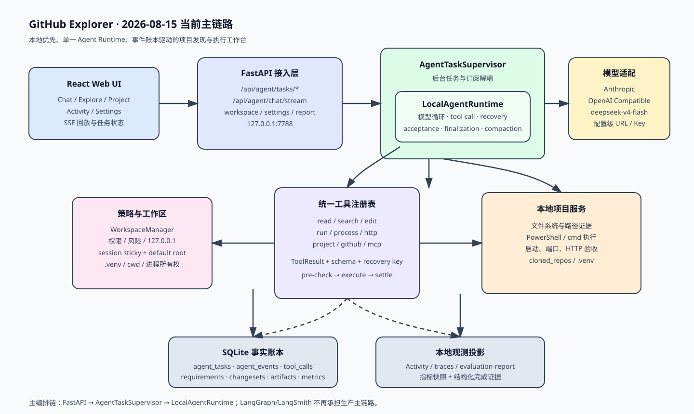
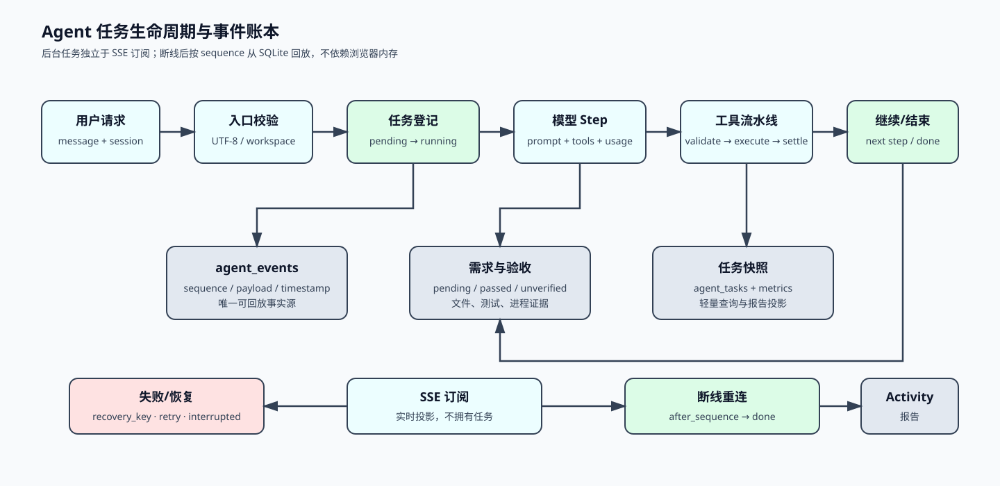

# GitHub Explorer 当前项目架构与实现报告

> 更新时间：2026-08-15（Asia/Shanghai）
> 代码基线：`src/` 最新实现
> 主服务：`http://127.0.0.1:7788/`
> Python 环境：项目根目录 `.venv`，Python 3.13.5
> 报告性质：基于当前源码、SQLite 结构、测试结果、真实多轮测评和成熟 Harness 研究的架构复盘



## 1. 执行摘要

GitHub Explorer 已经从早期的 GitHub 搜索页演化为一个**本地优先的项目发现、理解、搭建和二次开发 Harness**。它的核心场景不是单纯“帮开发者改代码”，而是：

> 找到一个 GitHub 项目 → 在本地建立独立工作区 → 让 Agent 理解并运行它 → 记录修改、测试、进程和证据 → 支持学习、实验和二次开发。

当前架构已经完成了几次关键收敛：

- 生产主编排统一为 `AgentTaskSupervisor + LocalAgentRuntime`。
- LangGraph、旧 Swarm 和 LangSmith 不再承担生产主链路或主观测。
- SQLite 任务/事件/工具调用/需求/指标快照成为本地事实底座。
- SSE 仅是事件投影和实时订阅，断线后可以按 `sequence` 回放。
- 工作区从全局当前目录改为“会话固定目录 > 全局默认目录 > fallback”优先级。
- 工具调用具备 Schema 校验、风险策略、恢复关系、唯一终态和结构化结果。
- 完成状态同时由任务终态、变更文件、验证、进程和 acceptance evidence 判断。

当前综合 Harness 质量评估为 **6.8 / 10**。优势在于本地项目工作流、事实账本、验收和观测；差距主要在沙箱隔离、插件能力边界、跨平台生态、真实浏览器 E2E 和发布闭环。

## 2. 当前运行边界

| 项目 | 当前事实 |
|---|---|
| 主服务 | `run_full.py` 启动 FastAPI，监听 `127.0.0.1:7788` |
| 前端 | `src/web` 编译为 `src/web_dist`，由 FastAPI 托管 |
| 桌面壳 | pywebview 可作为窗口容器，但不是 Agent 状态源 |
| 工作区 | 会话级固定目录，默认目录存于 SQLite 偏好 |
| 主模型 | 通过设置选择器配置，当前以自定义 DeepSeek 兼容配置为准 |
| 数据库 | `data/memory.db`，SQLite WAL 模式 |
| 旧服务 | 8000 为历史/既有测试项目，不作为当前主服务 |
| 外部 Harness | 3080 为 DeepSeek 官方 Harness，当前未修改、未停止 |
| 网络边界 | 服务仅绑定回环地址，不对局域网开放 |

## 3. 总体架构

### 3.1 分层结构

| 层 | 关键文件 | 当前职责 |
|---|---|---|
| 启动层 | `run_full.py`、`run_desktop.py`、`desktop/*` | 启动 Uvicorn，必要时创建 pywebview |
| 前端层 | `src/web/src/App.tsx`、`components/*`、`hooks/*` | Chat、Explore、Project、Activity、Settings、SSE 消费 |
| HTTP 接入层 | `src/main.py`、`src/routes_agent.py`、`src/routes_search.py` | Pydantic 请求、API、SSE、SPA fallback |
| 任务层 | `src/agent/runtime/supervisor.py` | 后台任务拥有权、订阅、断线、恢复、取消 |
| Agent 核心 | `src/agent/runtime/runtime.py` | 模型循环、工具调用、重规划、验收、最终化 |
| 工具层 | `runtime/tooling.py`、`runtime/registry.py`、`agent/tools/*` | 工具注册、Schema、风险、执行和 ToolResult |
| 策略层 | `runtime/permissions.py`、`workspace.py`、`processes.py` | 工作区、权限、进程、端口和本地执行边界 |
| 证据层 | `acceptance.py`、`evidence.py`、`verifier.py`、`project_projection.py` | 文件、测试、HTTP、进程、需求完成证据 |
| 记忆层 | `src/agent/memory.py` | SQLite 事实、需求账本、事件、指标、项目记忆 |
| 模型层 | `src/agent/llm.py`、`model_probe.py` | Anthropic/OpenAI-compatible、探测、模型调用 |
| 观测层 | `runtime/metrics.py`、`reporting.py`、Activity API | 指标快照、运行记录、结构化测评报告 |

### 3.2 主请求路径



一次 Agent 任务的实际路径如下：

```text
React UI
  -> POST /api/agent/tasks/start
  -> require_agent_workspace(session_id)
  -> AgentTaskSupervisor.start()
  -> LocalAgentRuntime.run()
  -> LLM 请求
  -> ToolRegistry 批量工具调用
  -> 权限/工作区/Schema 校验
  -> 本地工具执行
  -> agent_events + tool_calls + changesets 写入 SQLite
  -> verification / acceptance / finalization
  -> SSE 订阅按 sequence 投影
  -> Activity、Chat、Project、报告读取同一事实
```

## 4. Agent Runtime 实现

### 4.1 Supervisor 与 Runtime 分工

`AgentTaskSupervisor` 解决的是“任务由谁拥有”和“订阅断开后任务是否继续”：

- `start()` 为每个任务创建独立后台协程。
- 同一 session 不允许并发存在多个非终态任务，避免聊天串线。
- `subscribe(task_id, after_sequence)` 只读取事件，不拥有任务。
- 浏览器切页、刷新或网络断开不会取消后台任务。
- `resume_interrupted()` 复用原任务 ID，恢复原工作区和状态。
- 后台异常会落为 `failed` 任务和 `task_failed` 事件，而不是只返回 HTTP 错误。

`LocalAgentRuntime` 负责一次任务的内部状态机：

1. 加载工作区、上下文、项目记忆和历史需求。
2. 构建任务计划与 acceptance criteria。
3. 调用模型并规范化工具调用。
4. 执行工具批次并记录每个 call 的状态。
5. 对失败进行 recovery key 关联和有限修复。
6. 按阶段控制 inspect、implement、test、run 预算。
7. 运行完成证据校验和模型声明证据交叉校验。
8. 生成结构化 finalization，再由模型补充可读解释。

### 4.2 工具调用生命周期

```text
model tool_use
  -> normalize_tool_calls()
  -> create tool_call ledger (pending)
  -> schema validation
  -> permission/workspace check
  -> approval if required
  -> execute handler
  -> normalize ToolResult
  -> persist tool_run / tool_call / event
  -> settle exactly once
  -> recovery relation if retried
```

关键不变量：

- 同一个 `(task_id, call_id)` 只有一个最终状态。
- 失败调用不能被后续成功调用覆盖，只能建立 `recovered_by_call_id` 关系。
- 工具输入和输出都经过结构化序列化，协议标记和 DSML 不进入用户回复。
- 大输出进入 artifact 元数据和可按需读取的内容存储，不直接无限膨胀模型上下文。
- `ToolResult` 统一表达 `success`、`error_kind`、`data`、`changed_files`、`process_id`、`verification`。

### 4.3 诊断和行动预算

当前阶段预算：

| 阶段 | 默认上限 | 说明 |
|---|---:|---|
| inspect | 24 | 目录、文件、搜索、项目检测等读取 |
| implement | 16 | 创建、编辑、依赖和配置 |
| test | 8 | 测试和构建验证 |
| run | 8 | 启动、端口、HTTP、进程管理 |

诊断预算同时记录：

- 总诊断调用数 `diagnostic_tool_count`。
- 去重后的观察数 `diagnostic_unique_count`。
- `diagnostic_observations` 记录工具、路径、查询等稳定键。

相同文件的重复读取不再重复消耗唯一观察预算；预算达到后先要求模型基于已有事实重新规划，而不是无限扩散读取。

## 5. 工作区与本地操作

### 5.1 双层工作区

工作区解析优先级：

```text
会话绑定目录
  > 全局 default_workspace_root
  > cloned_repos fallback
```

会话状态保留：

- `root`：会话项目根目录。
- `current_path`：Agent 最近确认的工作路径。
- workspace profile：Git、Python、Node、venv、分支等项目画像。
- recent workspaces：最近使用目录，供 UI 选择和恢复。

这解决了早期“总是在代码根目录写项目”和“切换工作目录后状态反复回退”的问题。

### 5.2 本地执行边界

当前已实现：

- 路径 resolve 后的 workspace containment 检查。
- 127.0.0.1-only 的服务启动限制。
- 进程 PID、launcher PID、子进程树、监听 PID 和 cwd 记录。
- `wait_http(process_id=...)` 验证监听者是否属于托管进程。
- `.venv` 优先、项目 Python 解释器识别和 Windows shell 规划。
- 普通读取、搜索、创建文件、安装依赖和测试可自动执行；高风险动作通过权限策略处理。

仍未达到企业级沙箱：当前是工作区和策略边界，不是容器、Job Object、网络隔离或系统调用级隔离。

## 6. 记忆与上下文

### 6.1 SQLite 事实表

| 表 | 作用 |
|---|---|
| `agent_tasks` | 任务完整状态、计划、摘要、终态和模型上下文 |
| `agent_events` | 有序事件账本，`sequence` 是回放游标 |
| `agent_tool_calls` | 每个工具调用的生命周期和恢复关系 |
| `agent_tool_runs` | 工具输入、结果和执行时间 |
| `agent_changesets` | 文件变更路径和 diff |
| `agent_artifacts` | 大输出元数据和按需内容 |
| `session_requirements` | 长会话需求、状态和完成证据 |
| `agent_task_metrics` | 版本化派生指标快照 |
| `project_memories` | 工作区范围的可验证项目记忆和 FTS |
| `workspaces` | session root、current path 和更新时间 |
| `user_preferences` | 默认工作区等持久配置 |

### 6.2 上下文压缩策略

进入模型的上下文由以下部分组成：

- 当前用户请求。
- 最近必要的对话历史。
- 工作区画像和 repo map。
- 未完成需求，最多注入 24 条。
- 最近完成证据，最多注入 8 条。
- 当前任务摘要、工具事实和恢复关系。
- 压缩 handoff：来源 sequence、摘要版本、开放调用和下一步。

原始事实不删除；只压缩模型输入视图。这是 Explorer 借鉴 DeepSeek Harness、OpenCode 和 OpenHands 后形成的本地轻量方案。

## 7. 验收与最终回复

### 7.1 双维度终态

系统不再把“任务终态”与“作品状态”混成一个字段：

- **任务终态：** completed、incomplete、failed、blocked、cancelled、interrupted。
- **作品证据：** changed files、verification、process、HTTP、acceptance、artifact。

因此可能出现“任务被预算中断，但作品已有可运行证据”，前端和报告必须并列展示这两个维度。

### 7.2 模型声明与事实校验

验收器会读取：

- `package.json` 的 scripts 是否存在。
- Python 工作区是否存在 pytest 测试文件。
- 工具结果是否真实包含变更文件、进程或验证记录。
- evidence ref 是否位于工作区内且对应事实。

模型说“测试通过”不再自动等于测试通过。当前规则已覆盖常见 npm/pytest 场景，后续可扩展 pnpm、yarn、bun、uv、poetry、cargo、go、Gradle 和 Maven。

## 8. 本地可观测性

### 8.1 观测来源

```text
原始事实
  ├─ agent_events
  ├─ agent_tool_calls / tool_runs
  ├─ changesets / artifacts
  ├─ verification / acceptance
  └─ processes / requirements
        ↓
版本化 metrics snapshot
        ↓
traces / Activity / Project / evaluation-report
```

当前支持：

- 任务、状态、终止原因、完成证据、工作区和日期筛选。
- model error、provider truncation、tool failure、recovery rate。
- false completion、false incomplete、evidence coverage。
- 阶段预算、审批次数、进程和最后事件。
- `/api/agent/evaluation-report` 一次汇总任务 ID、工具、变更文件和产物元数据。

LangSmith 已退出主链路。原因不是远程观测没有价值，而是当前项目的核心问题是工作区、工具、事件和本地事实的强耦合；本地 SQLite 账本更适合当前开发和开源阶段，也避免把密钥、提示词和本地文件上传到第三方。

## 9. 前端实现

### 9.1 页面与职责

| 页面 | 主要内容 |
|---|---|
| Chat | 普通对话、Agent 任务、模型选择、流式回复 |
| Explore | GitHub 搜索、趋势、仓库发现、学习入口 |
| Project | 工作区、阶段、证据、操作动作和项目历史 |
| Activity | 运行记录、工具分组、失败/恢复、指标和筛选 |
| Settings | 模型 URL、协议、Key、模型发现、测速、连接测试、默认工作区 |

### 9.2 SSE 消费模型

前端 `useChatStream` 维护：

- `lastSequenceRef`：重连游标。
- `taskId`：任务身份，不用浏览器 tab 身份代替。
- `steps`：工具调用视觉摘要。
- `partialContent`：流式文本。
- `agentRun`：计划、变更、验证、进程和 acceptance。

最终 SSE 帧即使没有尾部换行也会 flush；页面切换后重新订阅不会取消后台任务。

当前暂不引入 Playwright 真浏览器依赖。浏览器级验收未来可以作为独立 skill 插件，用于真实页面切换、网络断线和 UI 恢复，不进入核心 Runtime。

## 10. LangGraph 与 LangSmith 的架构决策

当前项目已经完成从“保留两套编排链”到“单一主链路”的决策：

| 组件 | 当前定位 | 原因 |
|---|---|---|
| 自研 LocalAgentRuntime | 生产主链路 | 直接表达工具、工作区、账本、恢复和 Windows 本地事实 |
| LangGraph | 退出生产主链路 | 与现有事实账本、终态和恢复语义重复，增加状态机分叉 |
| LangSmith | 退出主观测 | 外部上传边界与本地任务事实不一致，当前需要本地可查询报告 |
| MCP | 可选工具接入 | 作为工具 Provider，不负责主编排 |

这不是否定 LangGraph/LangSmith 的通用价值，而是当前 Harness 需要一个可以控制工作区事实、进程所有权和本地事件回放的唯一核心。

## 11. 当前质量与成熟度

### 11.1 已验证能力

```text
后端 pytest：270 passed, 1 warning
前端 Node tests：35 passed
Vite build：1622 modules transformed
主服务：127.0.0.1:7788 HTTP 200
编码健康：application/json; charset=utf-8
结构化测评报告：100 tasks / 1181 tools / 89 changed files / 65 artifacts
```

### 11.2 仍存在的风险

| 风险 | 等级 | 说明 |
|---|---|---|
| OS 级沙箱不足 | P1 | 工作区 containment 不等于系统级隔离 |
| 高风险操作策略仍需继续收紧 | P1 | 需要确保后端确认优先于真正副作用 |
| 跨平台证据规则有限 | P1 | 当前主要覆盖 Windows、npm、pytest |
| 浏览器真实 E2E 未纳入核心 | P2 | 当前是 SSE/API 回放，未来可作为 skill |
| 自动修复发布闭环未完成 | P2 | patch/worktree/确认/commit/push/PR 尚未成为默认链路 |
| 多 Agent 暂缓 | P2 | 当前优先保证单 Agent 长任务可靠性 |

## 12. 与成熟 Harness 的关系

横向评分和详细优缺点见：

[Harness 横向评估报告](reports/2026-08-15-Harness横向评估报告.md)

结论不是“全面复制大厂”，而是取长补短：

- 从 DeepSeek Harness 学事件源、Seam 和不变量。
- 从 OpenHands 学执行环境、连接解耦和真实 E2E。
- 从 Aider 学 Repo Map、Git/diff、模型诊断和快速反馈。
- 从 OpenCode 学持久上下文、压缩恢复和跨平台工具细节。
- 从 OpenHarness 学 Skill、Provider Profile、Hook 和权限模式。
- 从 Claude Code 学交互节奏、计划、权限和生态体验。

## 13. 下一阶段路线

### P0：事实边界与安全

1. 把高风险命令确认提升为后端硬门控。
2. 为所有副作用工具补齐 containment、权限和审计测试。
3. 把 UTF-8、manifest 证据和进程所有权规则扩展到更多项目类型。

### P1：能力接口化

1. 抽象 `ModelProvider`、`WorkspaceExecutor`、`ProcessManager`、`EvidenceStore`。
2. 工具仅依赖接口，不直接读取全局环境和 SQLite 细节。
3. MCP、Skill、自定义模型和项目服务都作为 Provider 接入。

### P2：项目旅程产品化

1. 让 Explore → Project → Chat → Activity 使用同一个 project/session identity。
2. 把作品完成度、任务终态和下一步建议并列展示。
3. 增加真实中量级项目测评矩阵，持续记录工具轮次、恢复率、证据覆盖和错误完成率。

### P3：可选发布闭环

1. 隔离 worktree 应用结构化 patch。
2. 用户确认后 commit、push、PR。
3. 将发布、外部网络和高风险系统操作保持为明确的确认边界。

## 14. 总结

GitHub Explorer 当前最有价值的不是“拥有多少工具”，而是已经把本地项目工作流、任务事件、需求账本、验收证据和观测报告连成了一条可回放链路。它还没有达到 OpenHands、OpenCode、DeepSeek Harness 或 Claude Code 的整体成熟度，但已经形成了一个有明确差异化的细分方向：

> 面向 GitHub 项目学习、搭建、运行和二次开发的本地可观测 Agent Workbench。

当前 6.8 分是合理的阶段分：核心事实链达到可持续优化的基础，安全隔离、扩展边界、生态和 E2E 仍是决定能否进入 8 分区间的关键。
