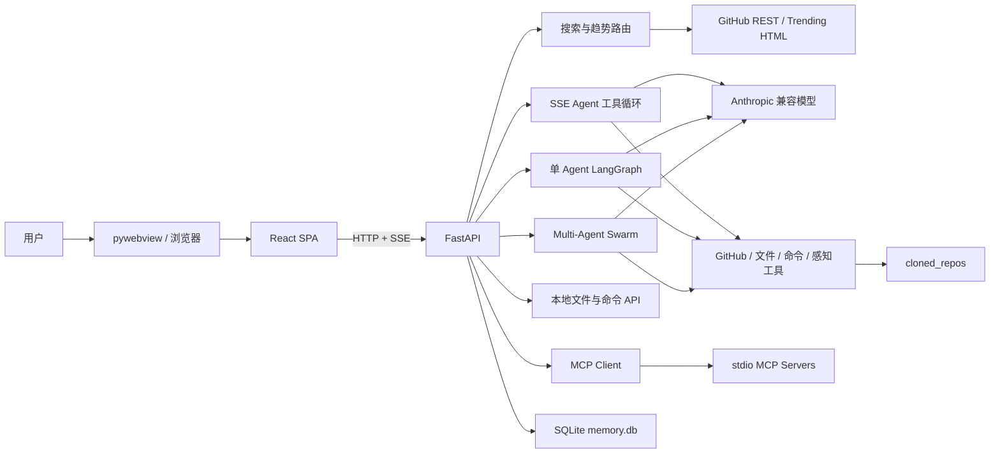
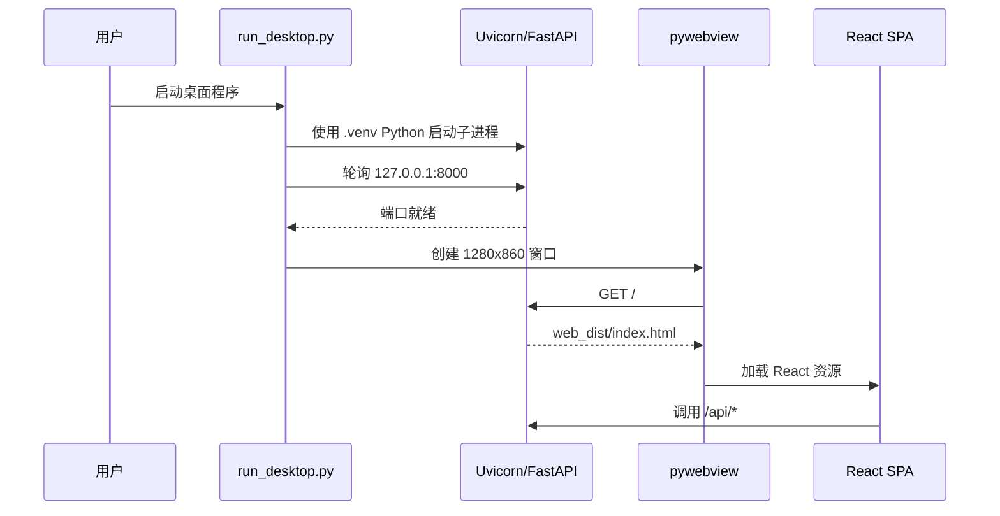
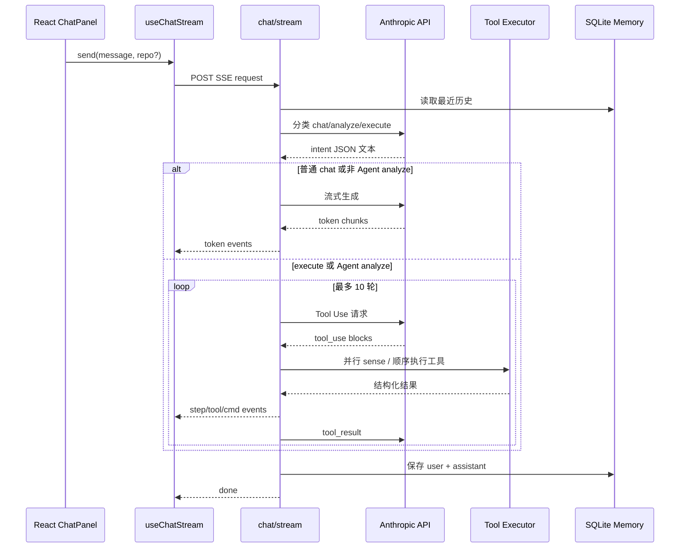
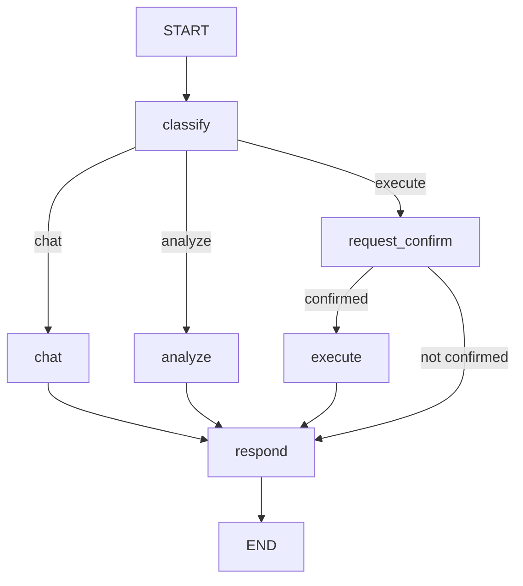
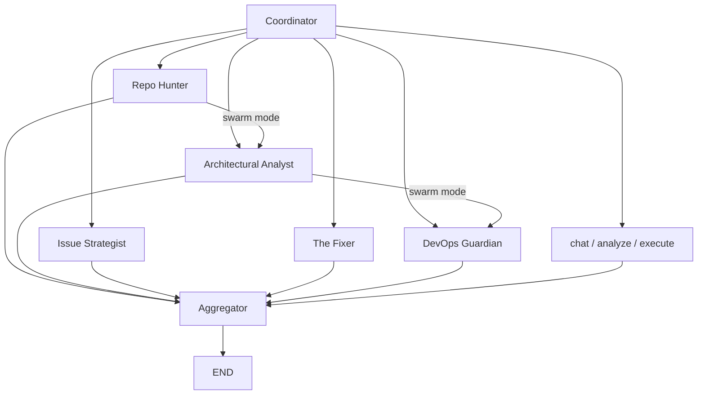
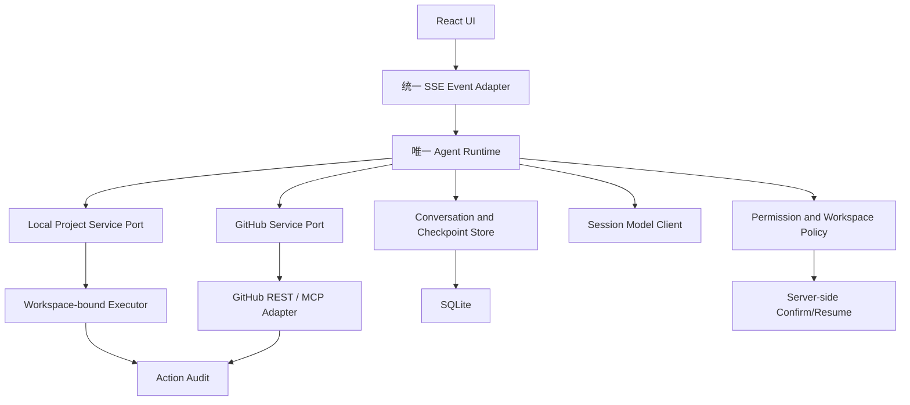

# GitHub Explorer 项目技术报告

> 报告日期：2026-08-09  
> 代码范围：以 `src/` 为最新版实现；启动包装层仅参考 `run_desktop.py` 与 `desktop/app.py` 解释运行链路  
> Python 环境：项目根目录 `.venv`（Python 3.13.5）  
> 报告性质：基于源码静态分析、FastAPI OpenAPI、离线冒烟测试与前端类型检查

## 1. 执行摘要

GitHub Explorer 已经从早期的“GitHub 搜索与趋势展示器”演化为一个本地优先的 GitHub 研究和执行工作台。最新版由四个主要能力层组成：

1. React 桌面式 Web 界面：提供聊天、仓库探索、模型设置和流式命令展示。
2. FastAPI 本地服务：统一提供 GitHub 数据、AI 对话、文件系统、命令执行、MCP 和设置接口。
3. Agent 运行时：同时包含当前前端使用的 SSE 工具循环、传统 LangGraph 单 Agent 图，以及独立的 Multi-Agent Swarm 图。
4. 本地持久化与项目操作：使用 SQLite 保存会话、项目、日志和感知状态，并可克隆、检测、安装和运行第三方项目。

项目的技术方向是清楚的：把“发现仓库、理解仓库、在本地操作仓库”放进一个连续工作流。但当前实现仍处于功能快速叠加阶段，存在多条重复链路、部分原型未闭环、接口契约漂移和较大的本地执行安全面。

当前最重要的结论：

- 前端主聊天链路是 `/api/agent/chat/stream` 的自定义工具循环，不是 LangGraph Swarm。
- Swarm 已实现独立端点，但没有接入当前 React UI。
- The Fixer 目前只生成修复文本，没有真正落盘代码或提交变更，无法形成真实修复 PR 闭环。
- LangGraph 注释声称 SQLite 检查点持久化，但当前实际使用 `MemorySaver`，重启后图状态丢失。
- 项目可在 `.venv` 下编译和导入，前端类型检查通过；但趋势和 MCP 功能缺少运行依赖。
- 服务已统一绑定 `127.0.0.1`，只能本机访问，但文件和命令接口仍缺少工作区边界与操作授权。

## 2. 产品定位与系统边界

### 2.1 产品目标

当前源码体现的产品目标比 `docs/PRD.md` 更广：

- 发现：搜索 GitHub、浏览真实 Trending、评估仓库健康度与学习价值。
- 理解：解读项目、分析架构、生成 Mermaid、分析 Issue、检查 CI/CD。
- 行动：克隆项目、识别技术栈、安装依赖、执行命令、尝试自动修复和创建 PR。
- 记忆：保存本地对话、项目状态、操作日志、用户工作区和 Agent 感知状态。
- 扩展：通过 MCP 连接外部 GitHub 与 Web Fetch 工具。

### 2.2 运行边界

- UI 与 API 都运行在用户本机。
- 最新版直接启动时由 `.env` 提供 `PORT=7788`，FastAPI 监听 `127.0.0.1:7788`。
- 旧的 `run_desktop.py` 包装链路仍硬编码 `127.0.0.1:8000`，与最新版直接启动端口不同。
- pywebview 只是窗口容器，实际展示 FastAPI 托管的 React SPA。
- 网络依赖包括 GitHub REST API、github.com Trending 页面、Anthropic 兼容接口、fal.ai 和可选 MCP Server。
- 本地副作用包括 SQLite 写入、Git 克隆、依赖安装、命令执行、文件创建/保存/删除，以及潜在 GitHub 分支和 PR 写操作。

## 3. 总体架构

### 3.1 分层职责

| 层 | 主要文件 | 职责 |
|---|---|---|
| 启动层 | `run_desktop.py`, `desktop/app.py` | 启动 Uvicorn、等待端口、创建 pywebview 窗口 |
| Web 前端 | `src/web/src/*` | 页面状态、聊天流、Markdown、命令输出和设置 |
| HTTP 接入 | `src/main.py`, `src/routes_*.py` | API 模型、路由、SPA 托管、SSE |
| Agent 编排 | `src/agent/graph.py`, `swarm_graph.py`, `routes_agent.py` | 意图路由、工具循环、子图调度、人工中断 |
| LLM 适配 | `src/agent/llm.py`, `prompts.py` | Anthropic SDK、流式输出、Tool Use、JSON 解析 |
| 工具层 | `src/agent/tools/*`, `tool_defs.py` | GitHub、命令、项目检测、Web、MCP、感知和 Critic |
| 数据层 | `src/api/*` | GitHub 数据模型、搜索、趋势、图片生成 |
| 持久化 | `src/agent/memory.py`, `tool_defs.py` | 对话、项目、日志、偏好、SenseState |
| 本地项目层 | `src/utils/local_launcher.py` | 克隆、类型识别、启动脚本与操作说明 |

## 4. 启动与部署链路

### 4.1 旧桌面包装启动（8000）

关键实现点：

- `run_desktop.py` 显式插入根目录和 `src` 到 `sys.path`。
- 后端子进程绑定 `127.0.0.1:8000`，日志等级为 error。
- 启动器最多等待 15 秒，超时后终止后端。
- pywebview 关闭时在 `finally` 中终止后端进程。
- `desktop/app.py` 仍暴露一套 `js_api`，但当前窗口 URL 指向 React Web 版本，主交互实际走 HTTP API。

### 4.2 最新版直接启动（7788）

`src/main.py` 读取 `.env` 后以 `PORT=7788` 监听 `127.0.0.1:7788`，这是当前最新版的实际启动方式。代码中的 `8000` 只是 `PORT` 缺失时的 fallback。前端开发模式的 Vite 配置仍将 `/api` 代理到 `http://localhost:8000`，因此开发代理尚未与 7788 对齐；生产构建输出到 `src/web_dist`，由 FastAPI 托管 `/assets` 和 SPA fallback。

### 4.3 环境假设

- Python 命令应始终来自 `.venv/Scripts/python.exe`。
- 当前 `.venv` 为 Python 3.13.5。
- 系统默认 Python 不属于项目运行环境，不应参与构建、测试或启动判断。
- 前端依赖已安装在 `src/web/node_modules`。

## 5. 后端 HTTP 层

FastAPI 当前生成 41 个业务路径，按职责分为六组。

### 5.1 搜索与仓库数据

| 方法 | 路径 | 实现 |
|---|---|---|
| GET | `/api/search` | GitHub REST 仓库搜索 |
| GET | `/api/trending` | 抓取 github.com/trending HTML |
| GET | `/api/repo/{owner}/{repo}` | 仓库详情 |
| GET | `/api/stars/{owner}/{repo}` | 估算 Star 历史 |
| POST | `/api/explain` | 单 Agent 项目解读 |
| POST | `/api/clone` | 本地克隆并生成启动说明 |
| GET | `/api/launch-instructions/{owner}/{repo}` | 获取启动命令 |
| GET | `/api/image/{owner}/{repo}` | 生成项目配图 |

### 5.2 当前聊天与 Agent

| 方法 | 路径 | 实现 |
|---|---|---|
| POST | `/api/agent/chat/stream` | React 主链路，SSE 工具循环 |
| POST | `/api/agent/setup` | 单 Agent LangGraph 执行路径 |
| POST | `/api/agent/confirm` | 恢复 LangGraph 中断 |
| POST | `/api/agent/execute` | 直接执行命令工具 |
| GET | `/api/agent/projects` | 读取项目状态 |
| GET | `/api/agent/history/{session_id}` | 读取后端会话历史 |
| GET | `/api/agent/logs` | 读取操作日志 |
| POST | `/api/agent/swarm` | 独立 Swarm 调用 |

### 5.3 MCP

| 方法 | 路径 | 实现 |
|---|---|---|
| GET | `/api/mcp/status` | 懒加载并连接 MCP Server |
| GET | `/api/mcp/tools` | 返回 MCP 工具目录 |
| POST | `/api/mcp/call` | 按名称调用 MCP 工具 |

### 5.4 模型与 AI 兼容接口

| 方法 | 路径 | 实现 |
|---|---|---|
| GET | `/api/settings` | 模型列表和脱敏密钥状态 |
| POST | `/api/settings/select` | 修改进程级活动模型 |
| POST | `/api/settings/models/{model_id}` | 持久化模型配置 |
| POST | `/api/chat` | 非流式单 Agent 对话 |
| POST | `/api/analyze` | 非流式分析 |
| POST | `/api/learning-path` | 学习路径 |
| POST | `/api/usage-example` | 使用示例 |

### 5.5 本地文件与命令

| 方法 | 路径 | 实现 |
|---|---|---|
| POST | `/api/local/run` | 带全局 cwd 的命令执行 |
| POST | `/api/local/reset-cwd` | 重置全局 cwd |
| GET | `/api/local/list` | 列目录 |
| GET | `/api/local/read` | 读取最多 1 MB 文件 |
| GET | `/api/local/info` | 系统信息 |
| GET | `/api/local/drives` | Windows 盘符 |
| POST | `/api/local/create-folder` | 创建目录 |
| POST | `/api/local/create-file` | 创建文件 |
| POST | `/api/local/delete` | 删除文件或递归删除目录 |
| POST | `/api/local/rename` | 重命名 |
| POST | `/api/local/save` | 覆盖写文件 |
| POST | `/api/local/set-workspace` | 保存工作区偏好 |
| GET | `/api/local/workspace` | 读取工作区偏好 |

## 6. GitHub 数据实现

### 6.1 `GitHubClient`

`src/api/github_client.py` 是异步 GitHub REST 客户端，核心数据模型为 `RepoInfo` 和 `StarHistory`。

实现特征：

- 使用 `httpx.AsyncClient` 和异步上下文管理器。
- 支持可选 `GITHUB_TOKEN`，认证后提升速率限制。
- 读取 `X-RateLimit-Remaining` 与 `X-RateLimit-Reset`。
- 处理 403、404、422、超时与网络错误。
- 对普通失败做线性退避重试，最多默认三次。
- 提供搜索、详情、语言、README、贡献者和同步包装器。

需要注意：`get_star_history` 不读取真实历史事件。它用当前 Star、仓库创建时间和线性平均增长估算过去数据，并加入随机波动。因此该接口只适合展示“估算趋势”，不能用于分析真实增长或做数据决策。

### 6.2 当前 Trending 主链路

React 探索页调用 `/api/trending`。该路由直接抓取 `github.com/trending`，用 BeautifulSoup 和 `lxml` 解析仓库名、描述、语言、总 Star、Fork 和周期新增 Star。

`src/api/trending.py` 还存在另一套完整的 `TrendingAnalyzer` 与报告生成器，但当前 HTTP 路由没有使用它。它属于保留实现或旧实现，形成了趋势领域的重复逻辑。

### 6.3 Agent GitHub 工具

`src/agent/tools/github_api.py` 是另一套同步 GitHub 客户端，面向 Agent Tool Use，提供：

- 仓库详情与搜索。
- Git Clone。
- 文件树与文件内容。
- Issue 与评论。
- 最近提交频率。
- GitHub Actions 运行记录。
- 创建分支、提交文件和创建 PR。

这套实现使用 `httpx` 同步调用，部分节点通过 `asyncio.to_thread` 避免阻塞事件循环，但并非所有调用都做了线程包装。

### 6.4 图片生成

`src/api/image_gen.py` 调用 fal.ai 的 GPT Image 2 接口，按项目名、描述和语言生成 4:3 PNG。当前所谓“缓存”只生成了 cache key，没有实际缓存容器或磁盘缓存，因此每次请求都会重新调用外部服务。

## 7. LLM 适配层

`src/agent/llm.py` 直接使用原生 Anthropic SDK，而不是 LangChain 模型封装。

提供四种调用方式：

1. `call_llm`：普通文本响应。
2. `call_llm_stream`：异步文本流。
3. `call_llm_with_tools`：Anthropic Tool Use，拆分文本块与工具调用块。
4. `call_llm_json`：在普通响应上提取 Markdown JSON 代码块或直接 JSON。

模型、密钥和 Base URL 都从进程环境读取。模型设置 API 修改的也是全局 `os.environ`，因此活动模型是进程级状态，不是会话级状态。

所有主要调用使用 LangSmith `@traceable`。是否上传追踪由 `.env` 中的 LangChain/LangSmith 环境变量决定。

## 8. 当前前端主链路：SSE 工具循环

### 8.1 请求流程

### 8.2 意图和工具策略

- 每次请求先调用 LLM 分类为 `chat`、`analyze` 或 `execute`。
- `execute` 总是进入工具循环。
- `analyze` 仅在 `agent_mode=true` 时进入工具循环。
- 当前 `App.tsx` 将 `agentMode` 固定为 `true`，且 toggle 是空函数，因此 UI 实际上始终开启 Agent 模式。
- 工具循环最多 10 轮，每轮由模型决定是否继续调用工具。

### 8.3 SSE 事件协议

后端事件类型与前端 `SSEEvent` 联合类型一致：

- `step`：阶段状态。
- `tool_call` / `tool_result`：工具调用和结果。
- `cmd_preview`：命令、风险等级和原因。
- `cmd_line` / `cmd_done`：实时命令输出和退出状态。
- `token`：模型文本增量。
- `done`：最终完整文本。
- `error`：错误消息。

前端将这些事件转换为 WorkChain、CmdBlock 和最终 Message，并把聊天记录保存到 `localStorage`。

### 8.4 命令执行与 Critic

`run_command` 使用 PowerShell 或 Bash 子进程执行任意命令。流式版本并行读取 stdout/stderr，并通过队列合并为 SSE。

危险命令分类器目前只识别有限模式，例如根目录递归删除、格式化磁盘、DROP/TRUNCATE、远程脚本管道。分类结果只用于 UI 警告，不会阻止执行，也不会等待用户确认。

命令失败后触发 Critic：

- 先用正则分类不可修复错误、环境缺失和依赖缺失。
- 未命中规则时调用 LLM 分类根因并给出修复建议。
- 最多三次修复尝试。
- 第二次开始剪枝旧上下文，只保留失败摘要，避免提示词持续膨胀。

## 9. 感知工具与 SenseState

Agent 模式在八个基础工具上增加四个感知工具：

| 工具 | 输出目标 |
|---|---|
| `sense_repo_health` | 健康分、维护状态、学习价值 |
| `sense_architecture` | 技术栈、模式和模块 |
| `sense_issues` | 痛点和建议方案 |
| `sense_devops` | CI/CD 是否通过及原因 |

`SenseState` 是会话级轻量状态，目标是把核心上下文控制在约 500 token 内。详细结果放在 `_detail_cache`，摘要通过 `to_context()` 注入提示词。

状态同时保存在：

- 进程内 `_states` 字典，便于快速访问。
- `memory.db` 的 `sense_states` 表，支持重启恢复。

感知输出经过手写 Schema 校验，要求指定字段和 Python 类型。需要注意，这不是 JSON Schema 库的完整校验，只覆盖必填字段和基础类型。

## 10. 单 Agent LangGraph

### 10.1 状态

`AgentState` 保存消息、用户输入、session、repo、intent、项目元数据、累积步骤、分析结果、确认字段和最终响应。消息与执行步骤使用 LangGraph reducer 自动追加。

### 10.2 节点

- `classify`：关键词预判，LLM JSON 兜底。
- `chat`：读取 SQLite 历史和项目状态，调用 LLM，并写回记忆。
- `analyze`：读取 GitHub 详情，区分学习路径、对比、通俗解读和深度分析。
- `request_confirm`：生成克隆、检测、安装、启动的确认清单。
- `execute`：克隆、检测、安装依赖，返回运行命令，但不自动启动项目。
- `respond`：保证最终文本非空。

### 10.3 检查点与中断

图使用 `MemorySaver`，不是 SQLite Saver。因此 LangGraph 的中断和检查点只在当前进程内有效。`data/checkpoints.db` 等文件虽然存在，但当前 `src` 没有代码使用它们。

图在 `request_confirm` 前配置 `interrupt_before`。实测即使初始状态传入 `confirmed=True`，第一次 `ainvoke` 仍会停在 `request_confirm` 前。因此 `/api/agent/setup` 当前返回时执行步骤为空，不会完成其声明的部署流程；需要先进入中断，再通过同一 thread 调用 resume。

## 11. Multi-Agent Swarm

### 11.1 主图

Coordinator 支持九类意图：`chat`、`analyze`、`execute`、`hunt`、`architect`、`issue`、`fix`、`devops` 和 `swarm`。先按中英文关键词匹配，再由 LLM JSON 分类兜底。

所谓完整 `swarm` 当前只串行执行 Repo Hunter、Architectural Analyst 和 DevOps Guardian，不会自动进入 Issue Strategist 或 The Fixer。

### 11.2 Repo Hunter

流程：搜索/详情 -> 提交频率 -> 健康度 -> 学习价值。

- 无 repo 时先让 LLM 提取关键词和语言。
- GitHub 搜索使用最低 100 Star。
- 同时调用 DuckDuckGo HTML 搜索作为外部上下文。
- GitHub 结果不足三个时，允许 LLM 补充推荐；这些补充结果可能不是实时验证数据。
- 健康度为 Stars 对数分 40% + 每周 Commit 分 60%。

### 11.3 Architectural Analyst

流程：远程文件树 -> 关键文件 -> Mermaid -> 设计模式。

- 关键文件包括 README、Python/Node/Rust/Go 构建文件和一个入口文件。
- 文件读取走 GitHub Contents API，不依赖本地克隆。
- Mermaid 和设计模式由 LLM 生成。
- 模式列表通过对自然语言行做简单前缀解析，结构稳定性有限。

### 11.4 Issue Strategist

流程：Issue -> 评论 -> 痛点 -> 三套方案。

- 从用户文本解析 `#42` 或 `issue 42`。
- 读取最多 100 条评论。
- 评论正文截断到每条 500 字符。
- 痛点和方案实际以单个长文本放入列表，不是严格结构化对象。

### 11.5 DevOps Guardian

流程：最近十次 GitHub Actions -> CI 状态 -> LLM 报告。

- 任一 conclusion 为 failure 即标记 `failing`。
- 没有记录标记 `none`。
- 其余情况标记 `passing`，其中可能包含尚未完成或取消的运行，判断较宽松。

### 11.6 The Fixer

设计流程是：准备仓库 -> 生成代码 -> Lint -> Test -> 最多三次自修正 -> PR。

当前实际缺口：

1. `write_code` 只把 LLM 文本放进 `fix_diff`，没有解析补丁，也没有写入本地文件。
2. 导入了 `commit_file`，但整个子图没有调用它。
3. 创建远程分支后没有提交，所以 PR 通常没有可比较的 commit。
4. `run_tests` 命令附带 `|| true`，在 Bash 下会掩盖测试失败；在 Windows PowerShell 5.1 下该语法本身可能无效。
5. 未识别语言的 Lint 会执行 echo 并返回成功，可能形成假阳性。
6. Swarm 主图在进入 The Fixer 前中断，但 `/api/agent/swarm` 没有对应 resume 接口。

因此 The Fixer 应被视为架构原型，不能视为已完成的自动修复能力。

## 12. MCP 架构

MCP 客户端读取根目录 `.mcp.json`，通过 stdio 启动 Server，使用 `AsyncExitStack` 管理流与 Session，并缓存每个 Server 的工具定义。

当前配置包含一个 GitHub MCP Server，通过 `npx -y @modelcontextprotocol/server-github` 启动，令牌由环境变量传入。

工具封装包括仓库搜索、代码搜索、文件读取、Issue 查询和 Web Fetch。调用时按工具名遍历已连接 Server。

当前 `.venv` 中没有 `mcp` Python 包，`requirements.txt` 也未声明它。因此 MCP 路由在首次实际导入客户端时会失败。

## 13. 本地项目与命令工具

### 13.1 项目识别

支持 Python、Node、Java、Rust、Go 和部分 .NET 标识文件。检测基于根目录文件签名，不分析 monorepo 子目录，也不支持同一仓库多技术栈的优先级表达。

### 13.2 依赖安装

根据语言和包管理器拼接固定命令，例如 `pip install -r requirements.txt`、`npm install`、`cargo build`。执行环境会移除 CONDA 变量和 `SSL_CERT_FILE`，但不会强制使用目标仓库自己的虚拟环境。

### 13.3 两套克隆实现

- Agent 工具 `clone_repo`：目标默认 `cloned_repos/<repo-name>`；目录已存在时会再次执行 clone 并失败。
- `utils/local_launcher.clone_repo`：目录已存在时执行 `git pull`，否则 clone，并可生成启动脚本。

两套实现的返回结构、更新策略和异常语义不同，是典型的重复领域逻辑。

### 13.4 命令执行器

- 同步执行器使用 `subprocess.run`。
- 流式执行器使用 `asyncio.create_subprocess_exec`。
- Windows 使用 PowerShell；另一个 `/api/local/run` 端点使用 `cmd /c`。
- 默认超时 60 秒，部分依赖安装和测试提升到 300 秒。
- 输出统一按 UTF-8 解码并替换非法字符。

## 14. 持久化设计

### 14.1 `memory.db`

SQLite 使用 WAL、5 秒 busy timeout 和 NORMAL synchronous。主要表：

| 表 | 作用 | 关键字段 |
|---|---|---|
| `conversations` | 后端对话历史 | session_id, role, content, repo, timestamp |
| `projects` | 仓库生命周期 | repo, status, local_path, env_configured, last_run |
| `action_logs` | 操作审计 | session_id, action_type, target, details, success |
| `user_preferences` | 工作区等偏好 | key, value, updated_at |
| `sense_states` | Agent 感知摘要 | session_id, JSON data, updated_at |

`Memory` 是进程级全局实例，SQLite 连接使用 `check_same_thread=False`。代码没有显式锁；WAL 能缓解读写竞争，但同一连接在高并发协程/线程中仍缺少严格串行化。

### 14.2 前后端双重会话存储

- 前端把完整 Chat 和 Message 保存到浏览器 `localStorage` 的 `explorer_chats`。
- 后端把最近的 user/assistant 文本保存到 `memory.db`。

两者没有同步、迁移或冲突处理。清理浏览器不会删除后端历史，删除前端聊天也不会删除 SQLite 会话。

### 14.3 检查点文件

仓库存在 `checkpoints.db` 和 `swarm_checkpoints.db`，但当前图使用内存检查点。它们不代表当前 LangGraph 状态会持久化。

## 15. React 前端实现

### 15.1 页面结构

`App.tsx` 管理三种 View：

- Chat：流式 Agent 对话。
- Explore：Trending 与关键词搜索。
- Settings：选择模型。

Sidebar 保存会话入口、探索入口和设置入口。页面采用固定左栏 + 弹性主区域布局。

### 15.2 聊天状态

`useChats` 负责：

- 从 localStorage 加载会话。
- 生成递增本地 id 和带时间戳的 sessionId。
- 新建、删除、选择会话。
- 第一条用户消息截取 20 字作为标题。
- 追加消息并立即持久化整个聊天数组。

`useChatStream` 负责：

- 每次发送前取消上一个 AbortController。
- 消费 SSE async generator。
- 维护步骤、命令块和部分文本。
- 收到 done 后构造最终 Message。
- 用户停止时中止 HTTP 请求。

后端子进程执行器没有在协程取消时显式 kill 子进程，因此用户中止流时存在命令继续在后台运行的可能。

### 15.3 消息渲染

- Markdown 使用 `marked`。
- HTML 经 DOMPurify 清洗后再 `dangerouslySetInnerHTML`，这一点正确控制了模型输出 XSS 风险。
- 代码高亮使用 highlight.js。
- 命令输出独立显示风险、命令、实时行和最终状态。
- WorkChain 展示后端步骤，但历史耗时用“步骤数 x 2 秒”估算，不是真实计时。

### 15.4 Explore

- Trending 支持今日、本周、本月和语言过滤。
- 搜索支持关键词与语言。
- 每个仓库展示 Star、Fork、描述、语言和前三个 Topic。
- 只提供跳转 GitHub，没有从 Explore 进入分析/克隆/Swarm 的产品闭环。

### 15.5 Settings

- 后端返回字段为 `active_model`。
- `App.tsx` 读取的是 `current_model`。
- 因字段不一致，启动时不会恢复后端活动模型，而是退回模型数组第一项。
- 模型选择会调用后端并更新本地 React 状态，但 API 错误被静默忽略。

### 15.6 前端依赖契约

`MessageItem.tsx` 直接导入 DOMPurify，但 `package.json` 没有把 `dompurify` 声明为直接依赖；目前它由 Mermaid 间接安装。该依赖关系不稳定，应显式声明。

## 16. 配置、密钥与安全边界

### 16.1 当前正向措施

- 所有正式启动入口只监听 `127.0.0.1`。
- Git Clone 使用参数数组而非 shell 字符串，降低注入风险。
- Markdown 在渲染前经过 DOMPurify。
- GitHub 写操作要求 `GITHUB_TOKEN`。
- 设置接口返回的是掩码密钥，不直接回传完整值。
- 命令执行有超时和有限风险识别。

### 16.2 高风险项

#### P0：源码与配置中存在明文凭据

`src/main.py` 的默认模型配置、`src/api/image_gen.py` 和根配置文件含明文 API 凭据。报告不记录具体值。这些凭据应视为已经泄露：吊销、轮换、从源码历史清除，并只通过 `.env` 或操作系统密钥存储加载。

#### P0：本地文件 API 没有工作区沙箱

`/api/local/read`、save、delete、rename 等接受任意绝对路径。虽然服务只监听本机，但任何能够请求本地服务的本机进程、浏览器扩展或被利用的页面上下文都可能触达用户文件。

#### P0：高风险命令只提示不拦截

`cmd_preview` 的 high 风险不会阻止 `run_command_stream`。当前实现是“先执行，再展示风险”，不具备人工确认语义。

#### P1：命令端点重复且安全策略不一致

`/api/agent/execute`、`/api/local/run` 和 Agent Tool Use 都能执行命令，分别使用 PowerShell、cmd 或 Bash，cwd 和风险处理不同。

#### P1：模型配置是全局可变状态

任何本地调用方都能切换模型或写入 Base URL，影响所有会话；Base URL 也可指向非预期服务。

#### P1：敏感数据可进入追踪

LangSmith tracing 若开启，提示词、仓库内容、命令输出或 Issue 内容可能被上传。需要明确的数据分级和脱敏策略。

## 17. 已确认的实现问题

| 优先级 | 问题 | 影响 |
|---|---|---|
| P0 | 明文模型与图片 API 密钥 | 凭据泄露与费用风险 |
| P0 | 文件 API 无工作区限制 | 任意本地文件读取、覆盖、删除 |
| P0 | 高风险命令不阻断 | Agent 可直接执行破坏性命令 |
| P1 | `/api/search` 将 `period` 传给 `sort` | 默认请求形成非法 GitHub sort 参数 |
| P1 | `bs4`、`lxml` 未安装也未声明 | Trending 端点运行即失败 |
| P1 | `mcp` 未安装也未声明 | MCP 端点运行即失败 |
| P1 | `/api/explain`、`/api/clone` 请求参数无 Pydantic 类型 | FastAPI 将 request 解释为 query 参数，JSON body 契约失效 |
| P1 | 单 Agent setup 停在 interrupt 前 | `/api/agent/setup` 不执行部署步骤 |
| P1 | The Fixer 不写代码、不提交 commit | 无法形成真实自动修复 PR |
| P1 | 测试命令含 `|| true` | 测试失败可能被判为成功 |
| P1 | Swarm Fixer 中断无 resume API | fix 意图无法从 HTTP 完整执行 |
| P1 | `active_model` / `current_model` 不一致 | UI 活动模型恢复错误 |
| P2 | Star 历史是随机估算但接口未标识 | 用户可能误认为真实历史 |
| P2 | `get_star_history` 异常分支引用未定义 `logger` | 原错误可能被 NameError 覆盖 |
| P2 | Agent、数据和克隆逻辑多套重复 | 行为漂移、维护成本增加 |
| P2 | LangGraph 用 MemorySaver | 重启丢失中断和图状态 |
| P2 | 前后端双份聊天无同步 | 历史删除与恢复不一致 |
| P2 | Abort 不保证杀死命令子进程 | 用户停止后命令可能继续运行 |
| P2 | DOMPurify 仅为间接依赖 | 依赖树变化可能导致前端构建失败 |
| P2 | `tests/` 为空 | 无回归保障 |

## 18. 验证结果

所有 Python 验证均使用项目 `.venv`。

| 检查 | 结果 |
|---|---|
| `.venv` Python 版本 | 3.13.5 |
| `python -m compileall -q src` | 通过 |
| `python -m pip check` | 通过；只证明已安装包内部依赖一致，不会发现源码未声明 import |
| FastAPI 应用导入和 OpenAPI 生成 | 通过，41 个业务路径 |
| `GET /api/settings` | 200 |
| `GET /api/local/info` | 200 |
| `GET /` | 200 |
| `npm.cmd exec tsc -- --noEmit` | 通过 |
| `tests/` | 0 个测试文件 |
| `bs4` / `lxml` / `mcp` import 探测 | 均缺失 |
| 单 Agent execute 首次 invoke | 确认停在 `request_confirm` 前 |

未执行需要真实网络、付费模型、GitHub 写权限或破坏性本地操作的端到端测试。

## 19. 架构评价

### 19.1 做得好的部分

- 前端、API、LLM、工具和状态层的模块边界已经形成。
- SSE 协议能表达文本、步骤、工具和命令输出，适合 Agent UI。
- Anthropic Tool Use 采用结构化输入输出，不依赖解析自然语言命令。
- SenseState 的摘要/详情分离方向正确，有利于控制上下文成本。
- Critic 采用规则优先、LLM 兜底，比所有错误都调用模型更稳定。
- Swarm 子图职责清楚，适合继续演进为可测试的领域工作流。
- GitHub API 数据模型较完整，错误类型和速率限制已有基础封装。

### 19.2 当前架构阶段

项目处在“能力原型向可靠产品收敛”的阶段。主要矛盾不是缺少功能，而是同一领域存在多套实现：

- 三条 Agent 执行路径：SSE 工具循环、单 Agent Graph、Swarm Graph。
- 两套 GitHub 客户端：异步数据层和同步 Agent 工具层。
- 两套 Trending 实现。
- 两套 Git Clone/项目启动实现。
- 两套聊天持久化：localStorage 与 SQLite。

继续增加功能会放大漂移。下一阶段应先确定唯一主链路，把原型能力迁移到它上面。

## 20. 推荐演进路线

### 阶段一：安全和可运行性

1. 立即轮换全部硬编码密钥，源码默认配置只保留空值和展示元数据。
2. 给文件和命令操作增加 workspace root 校验、路径 resolve 后的 containment 检查。
3. 高风险命令改为真正的后端中断和用户确认，未确认不得创建子进程。
4. 补齐 `beautifulsoup4`、`lxml`、`mcp`、`dompurify` 直接依赖。
5. 修复搜索参数、请求模型、模型字段和未定义 logger。

### 阶段二：统一主链路

1. 明确以 SSE 工具循环或 LangGraph 为唯一 Agent Runtime。
2. 若选择 LangGraph，将 SSE 变成图事件适配层，不再维护第二套循环。
3. 将 GitHub、克隆、项目检测统一为一个领域服务，异步 API 与 Agent Tool 共用。
4. 将 `api/trending.py` 与 HTML Trending 路由合并，明确真实数据和估算数据标签。
5. 将活动模型从全局环境改为显式配置对象或会话级配置。

### 阶段三：补齐自动修复闭环

1. The Fixer 输出结构化 patch，而非自由文本。
2. 在隔离 worktree/临时分支中应用 patch。
3. 运行不掩盖退出码的 lint/test。
4. 展示 diff 并请求用户确认。
5. 确认后提交、push、创建 PR。
6. 所有外部写操作记录审计日志并提供可恢复信息。

### 阶段四：测试与可观测性

1. 为路由契约、路径边界、命令风险分类、Sense Schema 和 LangGraph 路由添加单元测试。
2. 使用 `httpx.MockTransport` 测试 GitHub 403/404/422、重试和速率限制。
3. 添加 SSE 协议集成测试，覆盖取消、工具失败和最大轮次。
4. 添加前端 hook 测试和 Playwright 桌面流程。
5. 用真实状态机测试确认 interrupt/resume，而不是只测试节点函数。
6. 对 LangSmith tracing 增加显式开关、脱敏和数据保留说明。

## 21. 建议的目标架构

这个目标架构保留现有项目最有价值的部分：React Agent UI、结构化 Tool Use、LangGraph 子图、SQLite 本地优先和 GitHub 领域能力；同时收敛重复实现，把权限策略放到所有副作用之前，而不是仅在前端展示风险。

## 22. 结论

GitHub Explorer 的核心价值不是单个搜索页，而是“发现 -> 理解 -> 本地行动”的连续体验。源码已经具备形成这一产品的主要构件，尤其是 SSE 事件协议、工具调用、感知状态和 Swarm 子图。

当前影响项目进入可靠使用阶段的主要障碍是：凭据与本地执行安全、主链路分裂、原型能力未闭环、接口契约错误和测试缺失。优先完成安全收口和运行时统一后，现有代码可以在不推倒重写的前提下演进为结构清晰、可验证的本地 GitHub Agent 工作台。
